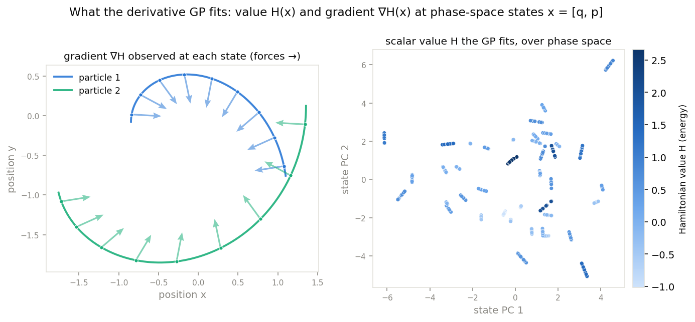

# auto_dgp

A testbed for investigating **the research capabilities of LLMs** — how effectively an LLM-driven
research loop (inspired by [Karpathy's autoresearch](https://github.com/karpathy/autoresearch)) can
make progress on a well-defined problem. The loop runs unattended in stretches, but the research is
human-steered rather than fully autonomous. **Derivative Gaussian processes** (GPs that observe
a function's *value and its gradient*) are the substrate, not the point: they are a concrete, checkable
domain the loop operates in so we can watch it work.

The substrate task is an N-body Hamiltonian system — predict the target value (and, where the method
supports it, its gradient) from gradient observations.



*Each observation is a phase-space state `x = [positions, momenta]` carrying a scalar value `H(x)` (the
Hamiltonian / energy) and its gradient `∇H(x)` (forces and velocities). The derivative GP fits both —
value **and** gradient — and predicts them at held-out states. (Figure: `docs/plot_nbody_example.py`.)*

Two reference points ground the loop:

- **base exact derivative GP** (`gp/exact`, `gp/cg`, `gp/kernels`) — the ground-truth starting point;
- **TERA** (`gp/tera`, a git submodule) — the best approximate GP baseline
  ([Seung & Katzfuss 2026](https://arxiv.org/abs/2606.02909); see [`docs/REFERENCES.md`](docs/REFERENCES.md)).

The current research candidate is **ORBIT** (`gp/orbit`): an exact orthonormal, matrix-free form of
TERA's target conditional with PCG and an exact-arithmetic residual-to-posterior-error certificate.
It has passed
algebraic controls but has **not** yet passed the predictive and matched-resource gates required to
call it a better GP framework; see [`docs/ORBIT_METHOD.md`](docs/ORBIT_METHOD.md).

Predictive evaluation now uses the compact protocol from the DSoftKI paper's toy N-body experiment:
four reported particle counts, a 90/10 split, three seeds, and value/gradient RMSE. See
[`docs/PAPER_NBODY_BENCHMARK.md`](docs/PAPER_NBODY_BENCHMARK.md). The earlier custom F02b calibration
matrix is retained as numerical-development history and its pending arrays must not be submitted.

Within the substrate, the loop's concrete objective is to beat these on value RMSE **and** calibration
(NLL) under a fixed budget.

## Getting started

See **[docs/STARTUP.md](docs/STARTUP.md)** for first-time setup (pull the TERA submodule, `uv sync`,
generate the data, run the tests and benchmark). In short:

```bash
git submodule update --init --recursive
uv sync
cd data && for n in 2 4 6 8 10; do uv run python get_nbody.py --n_particles $n --n_dims 3 --n_samples 10000; done && cd ..
uv run pytest -q
uv run python experiments/nbody_benchmark.py
```

## Layout

| Path | What |
|------|------|
| `gp/kernels`, `gp/cg`, `gp/exact`, `gp/common`, `gp/metrics` | the base exact derivative GP |
| `gp/tera` | TERA baseline (wrapper here; upstream source is the `gp/tera/vendor` submodule) |
| `gp/orbit` | ORBIT research candidate; matrix-free TERA conditionals and certificates |
| `data/get_nbody.py` | N-body Hamiltonian dataset generator |
| `data/generate_nbody_confirmatory.py` | leakage-free, fixed-mass, trajectory-grouped companion corpus |
| `data/load_nbody_confirmatory.py` | fail-closed bundle verification and train-only preparation |
| `experiments/` | benchmarks and experiments |
| `tests/` | correctness tests (the factored kernel matvec == dense, CG == exact) |
| `CLAUDE.md` | the research-loop rules and hygiene checklist |
| `docs/` | `STARTUP.md`, `REFERENCES.md`, and (as work proceeds) `RESEARCH_LOG.md` and `learnings.md` |

## Provenance

The code, tests, and docs in this repository are **generated by Claude**, to investigate the research
capabilities of LLMs.
